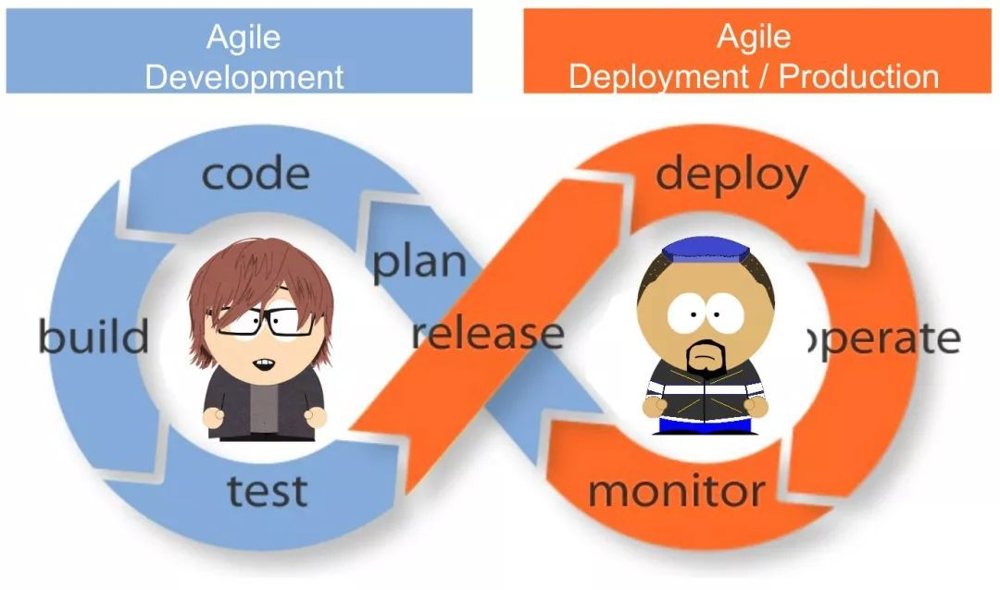

# 软件工程方法实践与验证
{:.no_toc}

* 目录
{:toc}

## 1、课程内容与要求

**1.1、课程概述**

软件工程是实践者的研究方法。它来源与软件开发实践，是实践者**最佳实践**的总结。[软件工程在企业中到底起多大作用](https://www.zhihu.com/question/41338706)？几乎所有参与过实习的同学都会提出类似的问题。悲观者就是怎么快挣钱怎么来，软件工程用不上；乐观者观点就是要用“最先进方法”，这个企业就是“土鳖”。显然，悲观者会把软件做的一团糟，乐观者会被领导认为好高骛远（不从历史、经济、资源、地域现状看问题的技术流）。因此，需要深入软件工程实践并在工作中验证它的价值，不断提升和改进软件工程应用能力。课程内容如下图：

**参考教材**

* [美] Hassan Gomaa 著，彭鑫，吴毅坚，赵文耘 等译，软件建模与设计：UML、用例、模式和软件体系结构，机械工业出版社，2014，ISBN：9787111467595

**作业与考核**

学生 8-10 人一组。每周讨论 1，2 个话题，每个组准备 PPT。

* 课堂参与 50% ：每人至少讲一次。每个团队缺一次，团队每人减 5 分
* 研究报告 30% ：每人提交一个软件工程实践专题研究报告。例如：“面向资源的设计 - 服务 API 设计方法与支撑工具”
* 课程实践 20% ：高性能 web 开发 -- 优惠卷发放系统。 
    - 以组为单位，组织竞赛。
    - 限制：服务器电脑 4-5 台，客户机数量不限
    - 具体环境、竞赛规则自定（第九周提交）
    - 按性能（每分钟平均发放优惠卷给客户的数量）排名给分

**1.2、软件工程与软件设计**

软件是具有特定功能计算机可以执行的代码与数据，包括执行程序、数据内容、程序生产与产品运维需要的各种文档。

**软件与用户**。软件以用户为中心，用户体验是软件设计的核心。-- 软件设计是“玄学”

* Customers = Stakeholders？ 他们如何影响软件设计
* Customers 是谁？ 软件设计如何定位市场。 “软件产品要先有，在做好”对吗？

**软件与质量**。产品质量是用户体验的基础，高质量是软件产品的根本。 -- 软件设计是科学

* 软件的质量属性？
* 用户体验好 = 高质量？

**xDD与工程实践**。基于经验（大家都认为是对的）的软件开发方法

* Model Driven Development (MDD) 
    - 什么是 MDD？
    - MDD 在软件开发中应用。[使用可视化和建模更改设计](https://docs.microsoft.com/zh-cn/visualstudio/modeling/scenario-change-your-design-using-visualization-and-modeling?view=vs-2015)
    - Model Driven Architecture（MDA） 模型驱动的架构
* Domain Driven Design?Development (DDD) 
* Feature Driven Development?Design (FDD)
* Test Driven Development (TDD)
    - [ATDD? BDD?](https://www.zhihu.com/question/20161970) 不明觉厉！

**软件工程**

* [概念、知识体系与标准](https://sysu-swsad.github.io/swad-guide/01-nature-software)

## 3、业务建模与分析

“他山之石，可以攻玉”。设计任何软件之前，都需要借鉴已有成熟软件的业务思路与方法，再创新性的满足客户需要。

目的：了解业务建模的基本方法与工具；理解核心业务建模的价值

1. 收集三种以上同类业务软件（如背单词），对核心业务（背单词）业务过程建模。对比业务过程之间的差异。然后，从市场定位（服务对象）、原理方法等角度分析设计师的设计选择（通常都是市场导向的）
2. 观察产品发展（版本变化）的历史，对其中某个核心业务过程建模。分析业务过程进化与用户、技术、市场等因素的关系。例如：作为个人快递的最后一公里，投递柜（以前类似的产品是邮箱）的产生与普及改变了人们的生活。
    - 1、科技公司发明了投递柜，它们自建了投递柜以及远程控制系统。注册的投递员在推广期免费使用投递柜。由于缺乏资源，仅能使用y移动平台向客户发送短信通知。
    - 2、随着产品推广，x公司与各大快递z公司达成协议。x公司在快递柜上添加了二维码扫描装置，z公司的快递员不仅可在快递柜上登陆（由z公司提供认证服务），且可扫描快递单号，投递入柜后自动由z公司发短信给客户。客户取件后，自动发送给z公司投递完成。
    - 3、x公司进一步优化服务，开发了微信小程序实现扫码取快递，并开发了寄件业务。如果用户关注了该公司公众号，直接通过过公众号推送给用户取件码等信息。不再发送短信。

## 4、用例建模

“慎思之，明辨之，笃行之。” 用在软件开发中就是：做正确的事，把事做正确。Do right thing 具体任务就是编写软件需求规约，其核心就是用例建模。描述、定义一个软件系统是软件开发的基础任务。然而，用例建模面临许多挑战，如技术创新、业务创新或交互创新发生时，不仅很难正确描述用户的使用产品过程。这直接导致了迭代方法的使用。（似乎什么都想做，每个方面都想超越同行，又似乎做不来或没意义，这个感觉你有么？）

目的：探讨 UML 用例图和 UML活动图 在用例建模中的使用；掌握识别用例的技巧，理解用例模型与开发（迭代）计划的关系。

1. 选择一款你熟悉经常使用的软件（通常它只有一个主业务），用自然语言描述它，并在此基础上给出用例模型。例如：自然语言描述版本 [某词斩](某词斩应用.pdf)。【备注，如果产品业务很多，如淘宝等，请选择一个功能模块】
    - 这个任务需要提供两个文档，分别是自然语言描述和用例模型
2. 选择你曾经开发或设想开发的创新产品，给出用例模型，并将用例模型转化为 Scrum 的 Backlog（迭代计划）。请描述建模方法与迭代技巧，并在模型中突出创新点
    - Scrum 可参考[《硝烟中的Scrum和XP》](https://www.infoq.cn/article/scrum-xp-from-the-trenches) 
    - 涉及敏捷开发管理工具（如：[腾讯 TAPD](https://www.tapd.cn/)） 的需求规划、迭代计划与故事墙的使用方法与技巧
3. 选择一组产品（最好是同类产品）分别给出用例模型，并用特殊颜色标注 VIP 或 收费的用例，总结 VIP 或 收费的用例或特性有哪些特点。例如：词典是受众很广却很难变现的产品，以有道词典为例，它有一个“发音指导”特征附在单词音标之后，每天只能免费用2次哦！
4. 以一款你参与开发的软件产品为例，描述用例建模实践。
    - 如果企业实践中没有建模，你必须给出 UML 用例图 以及 确当的UML活动图，并对比有模型和没模型的差异
    - 如果是产品扩展与升级，你必须用用例图、活动图描述新旧产品的变化
    - 实际软件开发用例建模实践比较多样，如有疑问请邮件咨询

## 5、数据建模

根深则叶茂。数据对象（实体对象）设计几乎是所有软件成功的关键，因为每个业务/用例的实现都需要数据的支持。工程中具体体现是实体对象及其关系的不同变化导致的开发成本不同。例如：一对多关系设计成一对一，则于其相关的数据层、逻辑层、表示层就要重新开发；仅是添加个别字段，则工作量很小；如果增加一个实体，则工作量依赖于它关联的实体。

目的：了解领域建模的方法与相关UML模型；掌握识别实体、属性和关联的技巧；验证模型的正确性。

1. 选择一款你熟悉的软件的某一业务使用流程，从中找出所有业务概念，给出用 UML 类图表示的领域模型（实体对象模型）。如果在该业务中某个实体对象存在生命周期，请用 UML 状态图描述。
    - 领域建模通常包含 一组类图 和 状态图
    - 需要给出建模过程，包括领域建模的设计要点等
    - 状态图通常用于表达在零售业务中订单（创建到关闭状态的变迁）
2. 数据建模方法很多，请根据你个人企业实践经验，介绍企业实战数据建模方法的方法与数据库设计工具
    - 在结构化设计中，采用数据流图、功能（处理）结构图、数据字典
    - 在面向对象设计中，采用领域模型，再逻辑建模
3. 给定一个数据库设计（用逻辑模型表示），请给出评审与验证正确性的实践方法
    - 假设有任何你要的前期资料，如：业务需求、用例描述、活动模型、领域模型、状态模型、甚至是原型界面等
    - 实体建模通常是面向问题领域设计。为了控制评审规模，请聚焦一个业务的部分场景
4. 介绍你熟悉产品的用户认证与鉴权功能相关的数据设计，必须满足以下两点：
    - 给出领域模型或数据库逻辑设计
    - 必须介绍它与现有成熟框架，如 Apache shiro 或 Spring Security 或其他框架，协同工作的原理。
5. 你们认为更重要或更有趣的内容

## 7、用例建模与数据建模案例分析

案例样本：[Asg-RH.pdf](https://sysu-swsad.github.io/swad-guide/material/Asg_RH.pdf)

这是21世纪初的一个在线旅游服务网站的定旅馆业务的操作过程描述。互联网业务与电子商务高速发展，一个15年前的网站与现在的网站有哪些差别？通过软件建模，你可以：

* 发现系统的业务服务、技术与数据内容的变迁
* 了解文化差异的影响
* 互联网应用创新的规律
* 为了争夺目标客户（流量）的努力

更重要的，通过建模可以让你更好的规划和组织软件产品开发，包括：

* 定义产品特征（Backlog）
* 支持迭代计划
* 安排技术学习与技术原型，消除技术风险
* 支持数据库设计
* 支持 API 设计
* 粗略估算项目工作量

参考对比网站，例如：

* [去哪儿](https://hotel.qunar.com/)
* [携程](https://hotels.ctrip.com/)
* [爱彼迎/airbnb](https://www.airbnb.cn/)
* [缤客/Booking](https://www.booking.com)
* [途家民宿](https://www.tujia.com/)

## 9、软件开发模型与项目管理方法

“组织的目的是使平凡的人做出不平凡的事”（[彼得·德鲁克](https://baike.baidu.com/item/%E5%BD%BC%E5%BE%97%C2%B7%E5%BE%B7%E9%B2%81%E5%85%8B)）。软件项目管理就是项目管理知识与软件领域（开发、运维与维护）具体特点相结合的产物。

软件项目管理要点：

* 具有专业知识的软件人的管理 - 推荐读物《[卓有成效的管理者](https://book.douban.com/subject/4020857/)》
* 高风险软件项目的事务的管理 - 推荐读物《[硝烟中的Scrum和XP](https://www.infoq.cn/article/scrum-xp-from-the-trenches/)》

目的：了解软件项目管理的复杂性；掌握 瀑布模型 与 迭代与进化的模型（如RUP，SCRUM）两种业界常用的软件开发模型；了解软件项目管理工具（如：[腾讯 TAPD](https://www.tapd.cn/)）。

1. 根据你的经历，结合案例介绍看板在软件项目开发中的使用经验。可包括但不限于：
    - 看板的模板
    - 看板周期（周，迭代）
    - 设立合理看板项（工作项）的方法与经验
    - 通过看板数据评估成员能力与工作量
    - 处理未完成任务的经验与技巧
2. 甘特图是项目任务与进度管理的重要工具，请选择以下一个话题：
    - 结合案例介绍甘特图的制作要点
        - 必须与开发过程模型结合
    - 如果你熟悉敏捷（Scrum）方法
        - 管理 backlog 的方法
        - 利用“燃尽图”控制项目进度的方法
3. 例会是项目组日常正式沟通的渠道。请介绍你的经验，可包括但不限于：
    - 如何避免把例会开成技术研讨会（技术研讨浪费多数人时间）
    - 作为项目组成员，如何准备每周例会
    - 软件项目例会议程
    - 例会必须达成的成果
4. 围绕软件开发过程模型的需要，介绍你熟悉的项目管理工具的使用。必须支持内容包括：
    - 需求管理
    - 进度管理
    - 看板
    - 问题管理
5. 项目管理内容很多，如大型项目的沟通管理、风险管理等方面的经验

## 11、软件架构概念与设计方法

【企业投标或方案用的图】[软件系统架构图-参考案例](https://wenku.baidu.com/view/c8fede1ff02d2af90242a8956bec0975f465a443.html)。尽管不是本课程内容，但在中国它们是行之有效的。这些玄乎（吹水）的图，是架构师能力的一部分。

架构师的任务：

* 面对客户（含非专业投资人），用图或表描绘系统业务与服务架构、系统技术结构，技术原理与方法等
    - 业务支持（产品“价值”）
    - 关键技术（产品“先进性”）
    - 安全、客户定制、国际化等等特征
* 面向产品开发团队
    - ？
* 面向运维团队
    - ？

软件架构的概念：P144

* 结构性元素 / 软件元素
* 接口 / 外部属性、行为与事件 / 元素之间协作行为
* 研究元素的设计与组合的方法与原则

软件架构设计：

* 给出一组用结构性元素表达的领域问题解决方案，即一组关于软件系统的组织的决策
* 架构设计方案是领域与平台相关的，即不同技术环境（年代）、不同应用领域（如在线电子商务，企业零售），其解决方案是有区别的
* 架构设计（的元素和接口、组合）是有规律可循的。具体领域这些元素越具体，例如 IBM SOA解决方案工程师，他的解决方案将依赖 IBM 产品与工具。更一般，这些规律表达为
    - 风格 Styles
    - 模式 Patterns

软件架构风格：

* 关于元素、接口、协同的设计指南与设计约束
* 例如：层次架构风格。软件元素是层，上层可以访问下层，每个层具有明确的职责（高内聚）。例如：一个 web 应用

软件架构模式：

* 指特定风格下，典型设计场景下特定问题，软件元素设计与组合的解决方案
* 通常设计模式名称、典型设计场景与问题说明、设计图（静态、动态图）、适用范围与局限分析、相关设计模式等部分构成
* MVC 设计是什么？

应用软件开发框架（Application framework / Software framework）：

* 是软件架构在特定语言、技术下的规范化编程模板，让程序员聚焦业务相关的核心元素实现，屏蔽系统的复杂性
* 例如：Java  Spring MVC 让用户聚焦三类元素的实现

软件系统分解与软件元素：

| 架构？| 设计类型 | 软件元素 | 风格 | 模式 | 备注 |
|------|----------|---------|------|-----|-----|
| 否 | 编程与算法设计 | 指令/语句/命令 | Code Convetion | 顺序、分支、循环   数据结构、算法 | 伪代码 |
| - | 结构化设计 | 模块/函数、数据实体 | ？ | ？ | 数据流图、模块（功能）结构图 |
| 否 | 面向对象设计 | 对象 | [OO原则](OOPrinciples.pdf)| OO设计模式 | 类图、顺序图 |
| 否 | 原型设计 | 界面   按钮、文本框等 | ？ | ？ | 模板 |
| 否 | 数据设计 | 实体 | 关系设计准则 | ？ | 领域模型、实体关系模型 |
| 是 |         | 子系统 | ？ | ？ | 集成通讯图（P161），系统上下文图/顶层数据流图，部署图|
| 是 |         | 层/业务模块 | 层次风格   C/S, B/S, 多层 | ？ | 包图，部署图 |
| 是 | 面向中间件设计 | 部件 | ？ | ？ | 模块（功能）结构图、组件图、组件协作图，部署图 |
| 是 | 面向消息的设计 |消息中间件| 同步、异步   定时、延时 | 生产/消费、负载均衡   过滤、路由 ... | RabbitMQ , Redis，部署图 | 
| 是 | 面向服务设计 | 服务 | [Restful](https://docs.microsoft.com/zh-cn/azure/architecture/best-practices/api-design) | [云服务模式](https://docs.microsoft.com/zh-cn/azure/architecture/patterns/) | 服务依赖图，部署图 |

一般来说，架构设计多数情况下会设计 **部署图**。用于描述了网络、服务器的组织与使用

软件架构设计方法论：

* 多视图设计方法（盲人摸象法）
    - FDD（特征驱动开发） - 软件特征：功能 + 质量要素（关于质量要素参见微软架构设计指南）
        - 功能（F）需求：业务功能，安全特征等
        - 非功能特征：
    - 多视图：不同利益相关人站在不同角度，思考一个系统的设计与实现，即观察、分解系统，得到不同角度的软件元素，以支持软件质量目标实现的成本、技术等，尤其是软件产品的中长期收益，通过技术选型与设计建模来解释或化解当前与潜在的产品风险。
        - 产品用户视角：功能结构
        - 开发者视图：包图（包或命名空间结构），软件层次结构图，组件图，交互图
        - 运维者视图：网络结构图，部署图
        - 安全管理视图：信息安全标准与方案
    - 架构设计视图与领域的关系
        - 关注产品具体语言实现：通常会直接关注软件应用框架与相关语言与技术
        - 关注产品在特定行业应用：通常会关注特定产品的组合。如 IBM 架构师，就关注 IBM 产品在特定领域应用结构
        - 关注云应用开发：通常关注服务的构建、组合、相关平台技术与实现
    - 一般架构设计
        - [运用RUP 4+1视图方法进行软件架构设计](https://www.ibm.com/developerworks/cn/rational/06/r-wenyu/)
* CMU/SEI（卡内基梅隆·软件工程研究所） ATAM（Architachture Tradeoff Analysis Method） 方法
    - 架构与软件质量目标之间关系分析
    - 案例：[票务系统架构案例分析](https://wenku.baidu.com/view/11b47770804d2b160b4ec0c9.html)

软件架构设计指南：

* [云应用程序体系结构指南](https://docs.microsoft.com/zh-cn/azure/architecture/guide/)

## 12、系统分解与 基于资源的 API 设计

1、 随着云计算技术的发展，软件系统通产会采用 云 + 端结构。即一个中小型软件系统分解为 客户端 和 云端 两个部分。本设计要求是，采用 RESTful 架构风格，设计云端 API，使得客户端与云端开发分离，做到独立开发与调试。

"云+端" 架构图 - 统一的客户端

* 客户端技术限制
    - 技术 javascript 或 移动平台。通常采用跨平台开发框架
    - 表示层采用 MVC 架构，实现人机交互；采用非关系数据库缓存数据，保存会话数据；采用 promise 实现与云端的异步通讯（特例： web socket 与 web hooks）
        - 例如： UVE 框架及其扩展
    - 客户端代码存放在静态网站上或移动app商店中
* 服务器端技术限制
    - 采用 HTTP/Rest 协议与客户端通讯。单入口访问，例如：api.myapp.com
    - 假设服务端是无状态服务，具有缓存加速资源获取
    - 统一的接口： REST is defined by four interface constraints: identification of resources; manipulation of resources through representations; self-descriptive messages; and, hypermedia as the engine of application state（HATEOAS）
    - 层次化结构
    - REST 风格定义：[Representational State Transfer (REST)](https://www.ics.uci.edu/~fielding/pubs/dissertation/rest_arch_style.htm)
* API 设计流程与工具
    - 假设你已经设计的界面原型，例如：一个公共博客网站的界面
    - 从界面提取了领域概念，并给出了领域模型
    - 根据界面操作要求，得到了每个实体的 CRUD 操作，以及需要的链接或导航按钮（HATEOAS 的要求）
    - API 设计与测试工具：swagger，Postman，zpizza 等
    - Rest API 设计规范
        - 微软: [Web API 设计](https://docs.microsoft.com/zh-cn/azure/architecture/best-practices/api-design)
        - Github: [Git REST API v3](https://developer.github.com/v3/)
* 设计要求：
    - 选择一个网站的的主业务（如博客发布与查看、定旅馆）部分页面
    - 给出领域模型
    - 根据网页，整理实体的 CRUD 操作，导航链接
    - 参考相关设计标准，使用设计工具将上述实体操作和导航映射到（设计） Web API
    - 暂不考虑 授权、Agent限制、流量限制 等
    - 暂不考虑 跨域、跨时区、多语言访问、版本，如 CORS、jsonP 等
    - 使用 PPT 介绍 API 设计过程与方法

2、系统分解是软件产品设计的基础。一般来说，系统分解方法可以按业务、用户、技术三个维度去分解（解耦）成系统、子系统、插入式模块，以适应不同行业、不同规模的用户。然而，这样的分解事实上是根据行业经验性形式的。以下是一些经验性的指南：

* 业务划分法
    - 业务种类：以旅游服务（去哪儿）为案例：旅馆、机票、门票 ...
    - 共性业务：用户管理、支付服务、搜索服务 ...
    - 业务规模：业务规模越大，系统划分越细致。如我们常说的财务系统仅指 账务管理系统，其他有计划财务、存货管理、报销服务、合并报表 ...
* 用户划分法
    - 组织架构（职责）：人事管理、财务管理、仓储管理 ...
    - VIP、地理位置（文化差异）、年龄 ...
* 技术划分发：
    - 共性技术支撑：工作流引擎、规则引擎、搜索引擎、人脸识别、消息中心 ...
    - 客户端：IOS，安卓，PC ...

如果您参与过大型软件产品开发，或有在大型企业技术咨询岗的经历。（注：请不要使用课程作业或竞赛用作品为案例）

* 介绍针对不同用户的软件架构决解方案。如你在 ERP 企业过咨询，有针对不同行业解决方案案例
* 或者 针对不同用户类型或业务要求的产品架构设计方案
 

## 13、云客户端应用的架构设计

场景：A 企业（如 x 银行）委托 B 软件企业 在 C 提供的 Kubernetes 容器云上开发某 云原生应用，业务界面类似[去哪儿](https://www.qunar.com/)这样的金融信息服务系统。A 企业项目技术负责人 X 非常熟悉 Java [多层架构](https://docs.microsoft.com/zh-cn/azure/architecture/guide/architecture-styles/n-tier) web 应用开发，也了解云原生的一些概念。B 企业架构师团队成员 Y 推荐了“云 + 端” 应用架构，并表示从开发角度，多层架构的表示层移到客户端实现，通过 RESTful WEB API 访问云端的业务服务层和数据层。以下是 X 和 Y 的简短对话

X：你们的客户端的技术架构（框架）是什么？

Y：我们公司目前主要使用 [VUE](https://cn.vuejs.org/) 作为前端开发框架，也有部分项目使用 [Angular](https://angular.cn/) 和 [React](https://react.docschina.org/)。

X: 我们银行客户端有 PC，但听说这些架构对 Web 浏览器有一些要求，我们部分业务还在使用 IE 6/8，能兼容吗？这可能关系到我们云桌面的采购。我们领导喜欢用 华为pad 查看系统，业务人员也希望其中部分业务对手机有很好的支持。我看了 [Angular](https://angular.cn/)中文介绍，对跨平台支持非常期待，我们以前是用 jQuery 和 Bootstrap 这样的响应式前端框架，还使用它们吗？

Y：目前主流浏览器 IE 10，谷歌浏览器，苹果 safari 等都支持的很好。IE 8 很少用，我回去和前端设计师问一下。Javascript 有很多 UI 库，图表（chart）库，似乎没听说前端使用 BootStrap，这需要问一下前端开发具体使用了哪些库。

X：开源带来的选择综合征是我们 IT 开发人员通病，新技术层出不穷啊。[React](https://react.docschina.org/) 采用组件化开发，VUE 也是吗？

Y：是的。

X：听说单页应用加载比较慢是吗？能做成多页应用吗？这样似乎更容易扩展，例如：行用卡、储蓄卡每个应用都是单页应用，然后集成在应用网站上。

Y：单一应用结构业务打包成一个 js 在业务较多时比较大。系统复杂时，是可以做成多页应用，打包成多个 chunk

X：很多业务之间都有一些相同的模块，如订房、订票都有类似的支付模块，多页面之间能实现业务模块共享和数据共享。Java web 需要服务端 session 上下文，现在都在客户端了，怎么实现呢？

Y：... （汗！！！）。这些技术细节需要问前端工程师，应该不成问题。

X：我们 Java 表示层就是采用 MVC 框架，分别对应数据实体、页面模板、控制器Action类，程序分解成三个部分即可，开发很方便。现在又来了 MvvM，Flux，Redux ... 等等，它们与 MVC 什么关系？

Y：MVC 是表示层通用的架构模式，Java MVC，VUE MvvM，React Flux 都是结合具体语言和平台特征的具体实现。现在主流前端框架都是支持 MVC 的。我回去让我的同事给你介绍一下我们前端的架构与框架。

X：好啊，我们同事也想了解一下前端的框架和相关技术的选择。以上问题是我们团队关心的，需要陈述清楚；具体选择哪种框架，我们也没倾向，你们自己给个理由；涉及的技术如 UI 组件库，图表组件库等，需要一个清单。如果是需要购买的第三方组件，要标出来；你知道我们开发规范的，除了代码规范外，我们需要程序框架设计规范，描述程序的目录结构以及必须的文件的名称，并给框架结构说明（目录包含的内容），以及子目录（模块）、文件的命名的规范，已方便未来的维护。

Y：OK，下周二例行协调会见

* 请针对上述客户关注的问题，做一个PPT，介绍你前端的架构与框架。
    - 你可能需要对前端性能做一些思考，例如：
    - 缓存：例如：通过 REST API 在前端缓存数据、图片
    - 预取：滑动列表分段获取资源，先取第一页，然后预取后面的页
    - 请使用代理模式，使得数据缓存等与界面组件无关

## 14、从层次架构到微服务架构（服务编排）

场景：A 企业（如 x 银行）项目技术负责人 X 最近非常焦虑，领导要求 X 带领项目团队走向流行的"微服务"架构。与 B 企业合作，在自己企业内容建立云原生应用开发技术体系，具体限制是微服务部署采用华为云[云容器引擎（Cloud Container Engine）](https://www.huaweicloud.com/product/cce.html)，数据库后台继续采用已采购的阿里云数据库服务（关系数据库、NoSQL数据库、数据仓库）。X 阅读了[微服务架构](https://martinfowler.com/articles/microservices.html)，[中文翻译](http://blog.cuicc.com/blog/2015/07/22/microservices/)，感觉问题不少。于是，请来 Y 聊天。

X：最近看了 Martin Fowler 关于微服务的定义，感觉将 Java 多层架构改为 HTTP 资源 API 不就是 微服务架构了吗？我们直接将 java 项目服务层、数据层用 Web API 给暴露出来，是不是就可以了？也这样就不用改后台开发模式了，再说 spring cloud 开发框架好大。

Y：这就是作者所说的单体应用架构或巨石（Monolithic）架构。如果我们的系统功能比较单一，如就是一个订房的服务，这样开发并没有问题。但我们的系统有许多服务，如订机票等。如果这些服务在一个应用（进程）中，这就出现了不同变更周期的服务绑定在一起的问题，也无法按业务负载变化动态的扩展资源。

X：网上的确许多人误认为改为 HTTP 资源 API 就可以变为微服务架构的说法，他们把多层架构的服务层、数据层都做成独立的 web API 服务，并在系统中注册这些服务的做法。是不是把原来系统中的各个模块都做成服务，这样虽然每个服务都可以独立分配资源（缩放/水平扩展），这粒度好细，会不会很慢？

Y：这牵涉到对业务能力（Business Capabilities）的理解。业务能力可简单理解为负载，假设一个客户端提供多种服务（订房，订机票），它们服务的客户数是不一样的。假设在一个业务（如订房）中，所有用户操作行为是相似的，则一万个客户端产生的各种相关的远程api调用是一千个客户端产生的api调用的10倍，显然后端提供十倍的服务能力即可，即能力可等比伸缩。但是，订房业务与订机票业务客户数量在不同时期变化是不一致的，假设订机票业务客户在1年内爆发增长，而订房业务提升缓慢，这是我们必然希望按不同业务的能力（客户数）配置云端资源，这就是所谓“围绕业务能力组织”应用。

X：有道理。订房、订机票等都需要支付服务，这时支付服务就需要按能力（需要支付的流量负载）做成独立的服务。所以业务服务（不包含系统的管理与治理服务）后台的架构设计就是从入口网关开始，画出服务依赖关系图，直到链接到具体的数据库（Backend）或外部服务结束。服务的划分除了传统的高内聚、低耦合要求外，还需要考虑业务能力与性能。

Y：是这样的，我们把各种服务按调用依赖或按事件（消息）驱动关系组织起来完成相关的业务成为编排（Choreography）。服务设计第一件是就是把后台系统分解为若干微服务进行业务编排，然后在容器平台上管理它们的实例（Instances），称为编制（Orchestration）。这对企业技术体系的建设也提出了新的要求。所以 Martin 说：“是产品不是项目”，一个产品是由许多小项目构成，每个项目就是一个服务（执行程序），它有明确的边界和职能。一个项目团队应该包含熟悉这个业务、数据、及其相关技术的人员。由于项目小，所以全栈工程师就是微服务时代的基本要求。

X: 看来执念于微服务多大是没有多大意义的事情，更要关注业务之间的关系，做好业务划分才是项目成功的关键，这对我们做甲方的也是一个新挑战。“产品思想与业务能力紧紧联系在一起。要持续关注软件如何帮助用户提升业务能力，而不是把软件看成是将要完成的一组功能。” 很精辟。

Y：是啊。Martin 在“智能端点和哑管道”总结了当时业务服务之间关系的构建技术现状，指出服务之间的关系可以用REST风格的协议来编排这些服务，或者使用多层架构中长用的轻量级消息服务，如RabbitMQ，Kafaka等。这几年，Google 在云云生应用内部推广 gRPC 支持高效的服务之间的通讯，在跨系统跨业务之间除了用 Rest 协议也可以使用 GraphQL 协议，以减少服务之间的通讯成本。

X：我对“去中心化治理”非常不解。最为一个金融企业，合作的IT企业近百家。为了减低风险和开发成本，现在委托开发项目基本是都采用固定的 Java 框架并给出了代码规范以便于测试、维护。现在微服务鼓励各玩各的，这怎么管理呢？

Y: 这是个问题吧，即使代码内部开源估计也解决不了。以开发语言选则为例，Java 不一定是开发微服务的最佳选择，spring cloud 这样重的开发平台对云资源的系统开销也是不容忽视的。这涉及微服务架构的管理与治理，特别是产品开发流水线的建设，DevOps团队建设。这就是作者在指出的基础设施自动化等内容。

X：做 Java 应用，Maven 把开发流水线搞的好好的。DevOps，PipeLine 概念这几年很热，我们也没有太多涉及，看来我们落后了。

Y：一个产品（应用）包含几十个项目，开发与运维不自动化估计是忙不过来。这几年我们也在不断尝试一些新的方法和工具来应对微服务架构带来的新问题。

X：“去中心化数据管理”更让人迷惑了。把一个数据库（Scheme）分为若干个小的数据库有必要吗？

Y：一个企业基础服务，如企业人员信息服务，也不希望每个项目都来访问企业人事数据库把。现在不是都通过ETL或数据库同步解决这些问题。通过微服务能很好解决这些问题，SOA 在企业信息集成的优势方面还是突出的。数据库的设计就涉及领域驱动设计(Domain-Driven Design, DDD)理念了。常规的，我们一个产品就是一个数据库。现在使用微服务，原则上一个封闭的业务或相关业务群一个数据库，把支付、账务、订票、订机票分为多个数据库也是比较好的选择。

X：也是这么一回事。先把我们的项目做一个业务微服务架构设计，即你们所谓的编排，并介绍你们微服务开发语言与相关的服务开发框架，服务开发的代码规范。如果其中部分微服务采用其他语言，请用不同颜色区别。另外也希望你们和我的同事介绍 gRPC 和 GraphQL，让我们了解它们与 Rest 的区别。以后再考虑微服务架构的管理与治理，产品开发流水线，DevOps建设等问题把。

Y：好的

ppt 要求：

* 请选择一个合适的产品，对业务范围做简单描述后：
    - 服务编排：画出后台主要的微服务，用圆圈表示（不同颜色表示开发语言）；服务间调用依赖用带箭头虚线表示，用构造型表示协议，如\<\<gRPC\>\>；服务间通过消息队列传递传递消息，请在带箭头虚线上给出消息名称；数据库用方块表示；服务需要访问数据库用带箭头实线表示
    - 例如：[Google Open-Sources 10-tier demo microservice application](https://www.tuicool.com/articles/ue6nAf6)
    - 给出你选择的开发语言（如java）微服务开发的框架、标准与规范
    - java Restlet（JaxRS） 等
* 分别介绍Rest、gRPC 和 GraphQL 服务接口技术

## 15、微服务（Orchestration）架构 - 网关（服务发现）与应用安全架构设计

场景：在 Y 团队介绍了服务设计后，X 总有一种“新瓶装陈酒”的感觉。这不是**逻辑架构设计**的另一种表达吗？最早用包图表示类的层次化组织，后来用组件（在 Java 应用中就是一个 Jar 包）图表示系统的结构，现在将这些组件按业务能力将这些组件组织成若干小项目，项目之间用 REST，gRPC 包装一番再调用，就成了服务编排（Choreography）。是该讨论**物理架构设计**实现了 ... ... 

以下是 X 和 Y 共有知识：

> 服务实例：服务实例是一个具有轻量级 WEB API 的进程。因此服务可以运行在任意机器上，服务实例 Endpoint 是客户端唯一的访问入口 ，它表示为 ip-address:port。在 Spring Cloud 中，服务实例运行在 Spring Boot 的 Java 虚拟器上，从而服务实例可方便部署在集群任意机器上。

> 容器服务：让一个服务进程运行在具有独立隔离的进程空间（有CPU配额、内存配额、文件系统、网络、用户等）上，多个服务共享同一操作系统内核。在 Kubernete 中，服务是一个进程组，除了主服务进程外还可配置存储、网络等服务，称为 Pod。容器服务实例每个都有独立唯一的 ip 地址，从而每个服务的实例都具有统一的 port，仅需将 service-name 和 instance-ip 对应，即通过集群内部容器（虚拟）网络 DNS 访问服务实例。  

> 编排工具：根据服务编排描述文件（如 docker-compose.yaml，描述服务镜像资源、服务与服务之间的依赖关系、及服务资源配置），在一个云平台上部署微服务应用的产品。如 kubernetes Helm 或 Docker Compose

> 服务编制：协调管理多个服务的动态调度过程，以满足服务编排描述文件的要求。如 Kubernetes, Mesos, Docker Swarm，Amazon ECS 等平台。如果是虚拟机平台，Spring cloud 自带服务编制需要的组件

> 云原生技术栈与工具：见 [CNCF landscape](https://landscape.cncf.io/)。服务架构与技术所有术语请尽可能保持 [CNCF](https://www.cncf.io/) 描述一致

X：在华为云上部署微服务是否一定需要使用 Spring Cloud 呢？华为号称秒级启动微服务！

Y：秒级就算了，启动个 TomCat 应用服务也要几分钟的。所谓秒级是指启动容器服务比启动虚拟机需要的时间短太多，所以现在微服务通常特指容器服务。按 [Spring Cloud](https://spring.io/projects/spring-cloud) 官方说法，“为开发人员提供了快速构建分布式系统中的一些常见模式的工具(例如配置管理、服务发现、断路器、智能路由、微代理、控制总线、一次性令牌、全局锁、领导选举、分布式会话、集群状态)。” 软件工程师通过简单配置或少量代码，可以在任何分布式环境（个人电脑、裸机集群、或云平台）下快速实现这些服务模式的服务与应用。关键不在哪家云平台，而在云服务模式的实现。

X：其他公司来我单位，都特别宣传它们的微服务环境，及其支撑产品，如服务注册与发现，统一 API 管理，高可靠可用等各种企业服务特性。我们已经花了大的价钱采购了华为、阿里以及 XX Java 微服务开发框架。它们都宣称支持服务注册与发现、智能路由等，难道这些都是免费的福利（开源软件）？

Y：许多公司微服务架构也是从 Spring Cloud 或 Dubble 这样框架开始的。随着容器与容器云技术的发展，这些服务模式部分固化为调度管理平台（如 kubernetes）的一部分，不仅简化了微服务应用开发，也脱离了对 Java 语言的依赖。我们公司专注产品应用，现在更多关注与不同云供应商的集成服务。

X：华为最近来宣讲过它们企业应用支持方案 [API 网关 APIG](https://www.huaweicloud.com/product/apig.html), [微服务引擎 CSE](https://www.huaweicloud.com/product/cse.html)。我们领导比较满意，已要求 XX Java 微服务开发框架开发商探索与华为的深度集成，我担心可能会影响我们项目的进度。其实，我们对云产品也是一头雾水，无论华为、阿里都给了许多产品和服务让你选择，也不知道哪些该买哪些不该买，所以领导对本项目的部署与集成方案非常重视。

Y：有钱开启买买买模式有啥不好，反正云服务是即买即用，不好就不用了。我们公司从不介入客户的采购决策，我们的产品既可以在虚拟机平台部署，也可以在容器云部署。我觉得对云服务架构模式理解，可能对你们采购决策有所帮助。从费用角度，使用我斯的智能路由或集成第三方路由都是收费的。

X：这也好，我们这个项目是单位第一个上云的微服务产品，是示范项目。云服务架构模式有哪些呢？

Y：服务架构模式也称为[云设计模式](https://docs.microsoft.com/zh-cn/azure/architecture/patterns/)，即根据云应用长期实践积累的基本问题与解决方案。

**服务入口相关模式**

我们从客户端 API 请求开始。这时就会涉及云服务商提供的 lbs（负载均衡）服务。这些负载会分摊到后台若干个服务器（以后成为节点）上，如果你仅用一个节点处理这些负载，lbs 服务就不用采购了；

[网关模式（API gateway）](https://docs.microsoft.com/zh-cn/azure/architecture/patterns/gateway-routing) 就是一个路由服务，它把应用外部请求发送到应用内部其他服务中，是应用的入口。与云供应商提供的 lbs 的区别，lbs 通常是 L3 网络层服务，gateway 是 L7 应用层负载均衡服务。应用 API 网关有多种实现方案

* 仅按 url 将服务分流到后台业务服务，即 ingress controller。通常 kubernetes 使用 Envoy 或 Nginx 就可提供这样的基础服务
* 如果一个企业有许多应用，多个应用之间需要通过 appID-appKey 授权访问、限流服务、断路与熔断、移动服务分离等时，就可以考虑采购云供应商的 API 网关。千万不要认为阿里云、华为云或其他云的网关是一样的。第三方 API 网关很多，具体见 CNCF landscape
* 开发能力强的企业，可能会有自己定制的网关服务。例如：Spring Cloud Netflix 采用 Zuul 作为网关服务，它采用过滤器结构，提供用户认证、限流、断路、路由等服务；或可以使用 Envoy 或 Nginx 的插件定制网关

[服务注册与服务发现]()： API gateway 主要功能是智能路由，它如何知道后台服务的 ip 地址呢？当平台启动该一个服务实例（容器时），就会在一个配置数据库（通常是强一致的 etcd）记录该服务的 服务名 和 ip 对，这个过程就是服务注册。当平台监控到服务结束，就是取消注册。服务发现就是根据服务名找到服务实例。

* 一般来说，容器云平台会采用内部 DNS 提供 服务名 到 服务 ip 的翻译服务，但这样负载分配策略会相对单一。
* 应用也可以直接访问配置数据库，以实现更复杂的负载分配、容错策略。在没有容器云的情况下，如 Spring Cloud Netflix 采用 Eureka 作为配置服务，Zuul 实现路由

[网关卸载模式](https://docs.microsoft.com/zh-cn/azure/architecture/patterns/gateway-offloading)：将共享或专用服务功能卸载到网关代理。 此模式可以通过将共享服务功能（如 SSL 证书的使用）从应用程序的其他部分移动到网关，简化应用程序开发。

* 由于 HTTP 传输安全问题，现代网站都是通过 Https 提供对外 HTTP 服务，因此网关需要配置 TLS 证书。但应用内部就可以使用 http 服务。
* 注意：网关做的事情越多，系统性能下降越大！！！

[熔断/断路服务模式](https://docs.microsoft.com/zh-cn/azure/architecture/patterns/circuit-breaker)，当超时达到一定次数就向保险丝一样熔断。

[用于前端的后端模式](https://docs.microsoft.com/zh-cn/azure/architecture/patterns/backends-for-frontends)，创建单独的后端服务，供特定的前端应用程序或接口使用。

* Javascript 开发成本远远高于后端

最佳实践指南：

* 入口服务越来越趋向于轻模式，即仅负责路由、Https转http；
* 业务服务集成越来越多，导致网关过于复杂

**认证与授权相关模式**

X：Java Servlet 都是用过滤器模式处理用户请求，变成服务就这么繁琐了。怎么没见用户认证模块啊，难道是每个业务自己完成用户认证与授权？

Y：是的，由于云应用由很多服务组成，每个服务完成自己需要的用户认证与授权与以前的程序一样啊。

X：但每个服务及其实例都要检查用户，这会产生性能问题

Y：云服务是无状态的，所以并没有 SessionID 作为 Web API 参数。为此，人们将证书与签名用于用户认证与授权，以分布式用户认证与授权代替传统的集中化管理

[联合身份模式](https://docs.microsoft.com/zh-cn/azure/architecture/patterns/federated-identity) 将身份验证委托给外部标识提供者。 可以简化开发、减少用户管理的难度。

Web API 安全目前就是 基本认证，Token 认证（JWT，OAuth2.0）

使用 JWT 与 STS 服务：假设一个企业每个应用有一对公钥和私钥。

* 业务服务发现用户没有认证，定向到登陆页面
* 向应用 STS 服务发送用户名、密码
* STS 认证该用户，按 JWT 格式给出负载，包括：用户名、组织、有效期、角色 ... 等，最后用私钥签名
* 服务用该应用公钥（从内部服务下载），验证签名

它的优势：

* 集中签发，分布式认证。由于需要认证的服务通常需要证书中的用户名等信息，由 API gateway 先查一次就缺乏必要性
* 单点登陆。如果证书存放在 app 缓存中，所有认可 STS 签名的服务都可以访问

[附属密钥模式](https://docs.microsoft.com/zh-cn/azure/architecture/patterns/valet-key) 。什么时候需要应用授权访问特别的资源，直接调用资源的 API 不就行了？ 最常见的业务场景就是“扫码干...”，例如：我要登陆 PC 版微信，它要你用手机微信扫码登陆；朋友发给我一个百度云下载码，我登陆后，输入就可以下载了。

Y: 服务管理还有很多基本任务如健康检测等管理服务，还有一些性能或通讯结构优化的模式，继续聊？

X：不早了，Spring Cloud 的服务模式如：配置管理、服务发现、断路器、智能路由、一次性令牌、分布式会话等大部分都讲了。但这样一个图也没有的聊天，很难理解啊。通过今天聊天，我大概明白路由服务、授权服务都是未来应用可复用的基础性服务。这样吧，你请你同事以本项目为在平台上部署为案例，介绍路由网关服务，用户管理服务、证书服务（STS）的设计与相关技术，性能优化等话题留着以后再讨论。

ppt 必须满足的要求：

* 集合具体云平台（可以是kubernetes，华为云，阿里云），描述 API 网关原理与实现
    - 需要描述 API 网关的主要特征与功能
    - 可以推荐用户使用云供应商 API 产品
    - API 网关一定要结合服务注册与服务发现服务
    - 最好结合具体平台配置。如给出 [ingress](https://kubernetes.io/zh/docs/concepts/services-networking/ingress/) 的配置描述 
* 服务安全设计
    - HTTP 协议传输安全，讲述 https 对微服务的重要性
    - 描述用户认证与授权安全管理的方案
        - HTTP 基本认证
        - 基于 Token 的认证
    - 用图（顺序图或通讯图）描述用户认证和验证的过程
    - 介绍 JWT。设计 JWT 格式内容，描述基于角色的授权管理（RBAC）方案
    - 进程或安全
        - 保证客户端是合法的客户端
        - 保证第三方应用调用是合法的第三方
    - 基于token的特别资源访问

Tips：

* [基于 STS 和 JWT 的微服务身份认证](https://www.infoq.cn/article/micro-service-authorization-sts-jwt) ，该文比较通俗易懂；
* [百亿流量微服务网关的设计与实现](https://www.infoq.cn/article/EeE1xZeic4UdpbmR*03t) ，可作为参考。API 网关需参考阿里、华为等的资料，以及 CNCF 产品地图。
* [K8s 工程师必懂的 10 种 Ingress 控制器](https://www.kubernetes.org.cn/5948.html)

## 16、微服务（Orchestration）架构 - 运用缓存、消息服务提升服务能力

场景：当一个应用分解为一组相互协作的服务后，分布式应用协同机制如智能路由、分布式认证等公共或专用设施的开发，为企业信息集成与信息化长期发展提供了新机遇。但是，过长的服务链调用或数据传递会不会影响性能呢？

X：在所谓“巨石”架构中，程序的性能需要使用 Redis 缓存机制 或 RabbitMQ 这样的异步消息机制实现进程协作，并提升系统性能。在云服务架构中，它们还一样用吗？不使用缓存，1000人同时在线的系统都非常难以维持。

Y：REST 风格架构本质依然是 Multi-Ties 架构，这是每个 Tie 是由多个服务实例构成。其中，客户端 Tie 管理维护应用状态，服务端的 Tie 无状态的服务的，所以才能按客户端多少分配资源，导致微服务架构服务性能与协作方面需要更多精细的设计。根据针对缺陷设计的思路，假设云上服务实例 99.99% 可靠，一个月约 4.3 分钟失效时间。传统的一主一备的 Redis，MySql 等需要分布式集群支持以满足高可靠、高性能服务的需要。

X: 呵呵，专家们总是把 Ties 和 Layers 分的特别清晰。经你这么一算，我们在云端创建一个 Redis 服务实例挺不靠谱的。现在云供应商不遗余力的推各种数据库服务也是有很有道理。普通用户在云端创建、管理和运维一个有状态的数据库，现在都变成一件奢侈的事情。

Y：云改变的不仅是技术手段，更需要改变的是我们的观念。作为测试，在云上启动单实例的数据库是没什么的；尽管云上部署Redis，Mysql集群也比较容易，由于缺乏在线备份手段（存储是要钱的），你也不得不依赖云服务商；非 IT 企业直接租用就好了。在云上，计算一般需要保存中间结果用于减少CPU计算时间，现在存储和CPU都要钱，这就变成一个可研究的优化问题

X：在云上，Redis、MQ、DB等服务除了需要集群部署外，还有什么别的需要关注的问题吗？

**资源的缓存管理与设计**

Y：以数据缓存设计为例，流量越高的站点或服务对缓存设计的要求越高，其设计目标是：

* 尽可能就近获取用户需要的资源，减少网络流量以及服务链的长度
* 尽可能在内存中获取用户需要的资源，减少对磁盘IO、数据库关系操作

从技术的角度，实现按需将资源放置到缓存，即 [缓存端模式](https://docs.microsoft.com/zh-cn/azure/architecture/patterns/cache-aside)。这时，数据缓存设计要考虑：

* 数据的生存周期
* 更新策略（write-through 或 write-back）与淘汰策略（FIFO，LFU，LRU）
* 缓存位置：应用内缓存（如 Java:EHCache,Guava;Go-GoCache）; 共享缓存（Redis）

云应用天生就是多级缓存的系统。特别是在[高并发场景下数据缓存要考虑一致性、穿透](https://www.cnblogs.com/dinglang/p/6133501.html)等场景 ... 因此：资源的缓存管理是每个服务设计的一个重要方面。

**消息服务设计**

Y：消息服务是多层应用中解决异步问题最常见的组件，在 web 应用中目前大概是 RabbitMQ 或 Kafaka 二选一。长期以来，人们总结了许多使用消息中间件的方式与模式。

例如：

* [RibbitMQ 使用的六种模式](https://www.rabbitmq.com/getstarted.html)，解决包括生产消费、负载收集-负载均衡、发布订阅、路由、RPC调用
* [云模式 - 消息模式](https://docs.microsoft.com/zh-cn/azure/architecture/patterns/category/messaging) 总结了利用消息和云应用程序性质将可伸缩性最大化常见场景。
* [Messaging Patterns](https://www.enterpriseintegrationpatterns.com/patterns/messaging/index.html) 【企业架构模式】总结。

以支付应用为例，通常一次支付最大响应时间在30s-60s以内。如果每个客户端发出请求后等响应，别说双十一，大概同时有1k-2k用户同时支付，一个服务器就挂了。在微软总结的 [异步请求回答模式](https://docs.microsoft.com/zh-cn/azure/architecture/patterns/async-request-reply) 中就介绍了客户端与服务器协作的解决方案。在这个模式中，你会思考`status endpoint`的实现？假设你的 web 服务将 支付请求直接交给发送队列然后返回，显然需要有个线程在一个接收队列等待结果，为了实现请求-结果的配对，就需要一个配对码，成为 `CorrelationId`，具体的见 [RabbitMQ RPC 模式](https://www.rabbitmq.com/tutorials/tutorial-six-java.html) 或 [Correlation Identifier](https://www.enterpriseintegrationpatterns.com/patterns/messaging/CorrelationIdentifier.html) 或者 [Return Address](https://www.enterpriseintegrationpatterns.com/patterns/messaging/ReturnAddress.html)。这个支付配对码对应的值 = false 就是在等待，否则就收到了结果。利用它，服务端就可以通过 Callback 完成支付成功或失败处理。关于`CorrelationId` 的生成，一般由一个工厂生成 UUID 或 Redis 的原子增量产生。如果考虑各种超时，这个过程将更加复杂。

X: 这么复杂，消息队列真是让人又爱又恨。我们以前都是用 java 长任务调用组件，有时总是产生一些不确定的 bug。

Y：是啊，都是血的教训换来的经验，趟坑是 IT 人的宿命啊。在处理长延时任务时，以前常常用单个消费者线程处理任务，一旦消费进程或线程挂起，会导致生产者产生突发的排队，也会产生问题，[使用者竞争模式](https://docs.microsoft.com/zh-cn/azure/architecture/patterns/competing-consumers)其实也系统的总结了这些的问题，即使是多个消费者，也需要配合熔断器工作也很重要。告诉客户支付服务忙，总比出现大量超时的用户体验好。

X：是啊，使用 Kafaka 总是担心在业务繁忙时产生消息丢失。这个问题似乎无解啊

Y: 在高并发的环境中，消息在队列里长时间积压、消息过期失效、消息队列满了、消息丢失等都是比较现实的问题。在消息生产端应做好过滤工作，即检测待处理消息数量，防止满了。对于包含大数据的结构通过消息总线，用 ID 传送；在传输过程中，使用路由分流负载；在消息消费端除了采用多个服务外，还要检测消息入队时间，避免计算失效的消息。只有综合治理，才能真正发挥消息队列的效用。

X：只看到消息队列解耦、发布订阅、异步的好处是不够的，还需要深入理解使用这些模式产生的实际问题才能做出高可靠的应用程序。谈及高并发与高性能，总要涉及CQRS和事件源模式，数据分库、分表、分片等，怎么看？

**数据管理模式**

Y：云计算与大数据的出现，这些变成了热点的话题。从我们的经验看，没有数十万用户在线 CQRS 估计是用不上的，目前的 CRUD 模块足够的好。但是，当大量的访问压力在数据库端时，数据库内在的事物锁机制就是性能的最大瓶颈。

CQRS 机制实施的首要条件是数据库配置成一主多读模式（不是双机热备）。数据写入操作在主服务器完成，通过同步复制更新日志到多个只读服务器，数据读出操作在读服务器完成（中间有时间差）。简化的说法就是把写相关的事务排成一个队列，如果这个队列保存到一个事件序列仓库，这就是事件朔源（Event Sourcing）。然后有一个专用服务按次序合并写操作，再完成写数据任务。这样我们就能显式监控到事务写的过程，有利于Bug分析（可溯源）。读操作就在多个服务器上完成（不需要锁），即 [CQRS/ES 架构](https://yq.aliyun.com/articles/353415)。大大提升了数据库服务能力。

数据分片，例如银行有上百、千万账户，如果这些账户都由一台服务器处理，仅查询语句就很慢（logN复杂度），这就需要将数据划分许多片，通过Map操作由多个服务器处理，通过Reduce聚合结果。这就需要 Spark SQL 这样的大数据处理平台。

我们现在已决定用云供应商的数据库和大数据平台，CQRS 都是有云供应商提供的数据库前端（例如 [Mycat](https://zhuanlan.zhihu.com/p/92415730) ）来完成了。至于阿里云、华为云后台分布式数据库如何设计我不知道，我们只需要会 SQL 以及一些优化知识就够了，SLA 由他们保证。

X：云计算的IT基础设施真的太复杂，自己建设也是自己采购，维护与优化都得外包。虽然我们技术团队自己编程任务不多，但有效使用缓存、队列以及CQRS等知识对项目团队监管项目是有用的，是否来做个技术培训讲座？

Y：没问题

ppt 要求：

* 结合案例，介绍缓存、队列、NoSQL、数据管理相关知识与模式
    - 添加 Redis 缓存服务 与 消息服务，完善微服务架构设计。
    - 结合 CNCF 技术栈框架，介绍分布式数据、分布式消息产品
    - 由于内容太多，请根据团队的知识结构与兴趣，选择1-2个方面重点介绍

## 17、微服务（Orchestration）架构 - 监控、日志（审计）与 SLA 管理

场景：X 认为从云应用程序结构分解（架构）的角度去审视项目有利于避开各种供应商提供的技术细节。但近来总有供应商提供监控、日志管理产品，X 从内心觉得 Java 多层架构中这些问题都不是问题，决定与 Y 聊聊。

**监控、日志**

X：云应用必须采购 [ELK](https://www.elastic.co/cn/what-is/elk-stack) 这样的日志服务吗？ Java 本身日志很好啊！

Y：CNCF 云原生路线图（[Trail Map](https://github.com/cncf/landscape)）中监控和分析是云化应用的第四步。在 [LandScape](https://github.com/cncf/landscape) 中数据监控与分析覆盖 runtime 以上三层，占一个独立部分。细分为监控、日志、追踪三大类产品。从 Java 日志技术发展来看，也是随着应用程序大量使用第三方模块后才逐步统一为 slf4j 这个门面。云应用从一开始就涉及多个服务实例，尤其是它们分布在不同机器上，采用不同语言开发。对于 Java 单体应用，一个模块发生问题，一个节点整个应用就挂了；一个进程或服务挂了、或者发生错误，故障可能会在局部传播，但业务系统依然在运行。对单体应用，监控到节点（主机）就够了，日志仅需分析该主机的日志。而微服务应用，必须监控到服务及其实例，并自动完成熔断操作。而服务的异常可能与所在主机的网络、存储...CPU资源等软硬件环境异常、也可能是自身bug、甚至可能是调用第三方服务等照成。由于服务日志分散在不同容器中，必须及时收集（服务挂了后，容器资源就回收了）。因此，我们需要一个高性能、分布式日志系统，高效完成采集、传输、存储、分析、呈现等服务，ELK 就是其中的一个开源软件常见组合。鉴于云生态的特殊性，日志、监控等一开始就受到高度关注，社区几乎和 

X：开源不等于免费。你玩得转才免费，没这个能力就得出些服务费用，反正总比 IOE（Ibm Oracle EMC）产品便宜。监控也得购买吗？

Y：基础监控工作，包括节点、服务、服务实例的健康状态，资源占用，甚至服务之间的流量分析，云供应商都会提供的。作为甲方团队，熟悉一种监控方案是必须的，例如： [cAdvisor](https://github.com/google/cadvisor) + [Prometheus](https://prometheus.io/docs/introduction/overview/) + [Grafana](https://grafana.com/)。Prometheus 的核心是时序数据库，支持 PromQL 查询。Prometheus 与 Kebernetes API 紧密集成并自动发现节点，直接收集节点与服务信息（从每个节点上 cAdvisor 服务采集）。应用程序也可直接 push 度量给 Prometheus，如 istio 等。Grafana 几乎是通用的呈现端，支持 Prometheus、Influxdb、Elasticsearch 等后端时序服务器。

X：Elasticsearch 和 Prometheus 都是时序数据库，似乎 ELK 与 PAG 组合对应啊，它们功能似乎类似。

Y: 监控关注实时性能，不需要特别精准，一般使用 UTP 作为传播协议；日志通常关注 StdErr/Stdout 等文件输出的收集，关注长期收集的大数据的分析；Tracing 关注 Request/Response 链的传播过程记录。 

**系统健康 与 SLA 管理**

Y：SLA（Sevice Level Agreement）管理是云服务重要内容，在云上的每个应用都应该提供 系统健康 与 SLA 监控与统计服务供给运维团队。用户使用 Prometheus 与 Elasticsearch 就可以方便的收集各个应用的数据，然后使用 Grafana 在监控大屏上显示出来。

X：难道我们运维团队需要和你们一起设计系统健康与 SLA 统计吗？

Y：是必要的。我们的应用程序是很优好的，只要在应用部署描述中，设置了 Prometheus 服务地址，重要的数据就会按需要发送到监控的。以 Java 应用为例，我们提供了专门的 Filter 类帮助客户监控服务的性能，我们使用的每种语言都有这样的中间件，但使用中间件的缺点就是与应用程序耦合比较紧。如何客户喜欢更灵活的方案，我们建议使用 [代理机制](https://docs.microsoft.com/zh-cn/azure/architecture/patterns/ambassador) 或 [Sidercar 技术](https://docs.microsoft.com/zh-cn/azure/architecture/patterns/sidecar)，灵活的管理性能和流量。流行的说法叫 service mesh 技术。

Servic Mesh 就是容器时代的 Java AOP（面向方面的编程） 技术。说白了，与通过一个代理对象访问业务对象一样，你得通过一个代理服务访问一个业务服务。这时，仅需要管理代理服务，就可以监控性能与管理流量，避免使用中间件对程序的侵入性。Istio 等这方面工作做的不错。

X：我们运维团队有事了。请你们给我们介绍下日志、监控、或基于service mesh的服务治理技术架构和案例如何？

Y：没问题

ppt 要求：

* 介绍下日志、监控、或基于service mesh的服务治理技术架构和应用案例
    - 不可泛泛而谈，请在日志、监控、基于service mesh的服务治理 中三选一
    - 资料可在网上收集，核心技术架构请到官网验证一下，以避免使用多年前的技术资料
* 假定不使用 service mesh 技术，请给出某种语言 rest/http 服务监控中间件与配置的设计，时序数据库采用 Prometheus
    - Java 就是 Filter 和 Listener
    - Golang 就是 negroni 中间件
    - 建议在 docker 环境下搭建 cAdvisor + Prometheus + Grafana 技术结构测试中间件；Kubernetes 平台下使用 Prometheus + Grafana。

## 18、微服务（Orchestration）架构 - 开发流水线与 DevOps 工具集

场景：X 现在理解了，从代码开发角度依然使用传统的方法，而云应用关注了企业业务代码的服务化，企业以业务服务能力为中心构建灵活的（服务复用与自由组合、计算资源按需租用）、可伸缩的新一代的 IT 基础设施。现在有个很热的词 DevOps，它是软件开发商的职责呢？还是甲方的职责呢？

X：云应用开发都谈 DevOps 这个概念，你们需要我们配合吗？

Y：需要啊。我们开发环境都定在你们单位，所以得提供整套 DevOps 工具。由于开发语言和习惯不同，所以 DevOps 工具比较繁杂。好在其中大多数工具云供应商都提供了。

X：DevOps，CI/CD，Pipeline 在云计算中经常提及，但似乎又是同一概念，例如：[给产品经理讲讲，什么是持续交付和 DevOps](https://cloud.tencent.com/developer/article/1151043)

Y: DevOps 起源于构建自动化，如 make 公寓解决了复杂依赖的多个程序的编译、链接问题，Java 对应的是 Ant。在组件的时代，组件的组织、开发、存放、检索、版本依赖问题就非常突出了，自然就有了 Maven。它统一命名程序组件，申明式组件环境与依赖配置，支持组件或应用开发[从代码检查到部署所有步骤](https://www.runoob.com/maven/maven-build-life-cycle.html)，构件了覆盖全球的分布式 Maven 仓库。开发者可以方便的管理、组织组件库，迅速开发程序。go 语言的 go 命令行，Nodejs 的 npm 等都是完成类似的任务。传统的应用开发的结果通常只有一个程序，测试与部署相对简单。而云应用运行涉及多个程序以及它们之间的依赖，每个程序又是自主的开发、升级，云基础设施环境又非常复杂（涉及技术众多、缺乏统一标准），因而普通开发者根本没有能力从零开始一步步完成开发、测试、部署、运维过程。因此，CI/CD 也是这几年初创公司最喜欢的领域之一。

“ DevOps ”一词源自“开发 - Development ”和“运维 - Operations ”的词汇组合，直观的理解即 "Dev ... Ops" 全生命周期服务，或是通过一组工具与脚本实现开发到运维过程的自动化。几乎所有云供应商都有这么一支 DevOps 团队，为大客户提供从上云业务咨询、开发过程支持、...到运维监控全方位的支持。

除去上云业务方案与技术环境支持外，DevOps 通常包括以下技术与工具：

* 源码仓库（Source Repository）。又分为本地仓库，和远程仓库。开发者提交本地版本到远程仓库，也称为 Check-In。典型源码仓库：Github，码云，GitLab 等；
* 持续集成（Continuous Integration）。即当远程仓库收到 Check In 完成，如果满足一定条件，如项目根有 `.travis.yml` 文件，仓库配置了 web-hook 等，测试服务如 Travis 就会自动启动该项目的单元测试与集成测试，并将结果返回开发者。典型测试工具：在线的 Travis，本地的 Jenkins 等；
* 持续发布（Continuous Publications）。当测试通过，则会触发镜像仓库（Docker Registry）根据项目中 .dockerflie 自动构建产品镜像；或者由构建程序构建镜像，并发布到镜像仓库。
* 持续部署（Continuous Deployment）。当新的镜像构建后，可以通过 web kook 通知云应用管理程序自动升级；也可以由 CI/CD 一体化工具用脚本部署、升级云应用。例如：Github CI 
* 流水线（Pipeline），就是 CI ... CD 全过程或者 DevOps 过程的管理及工具，例如 Gitlab Runner。作为流水线就是要关注 CI、CD 每个环级的输出结果（或者要对结果进行度量），通过数据分析，保障过程的执行效率，促进团队成员技能提升，提升产品质量。 

很多工具可以通过配置脚本一体化完成这个流水线，特别是在 docker 基础上构建。如 Jenkins PipeLine，Drone CI，华为云 [ContainerOps](https://support.huaweicloud.com/usermanual-containerops/ops_01_0003.html)，阿里云 [codePipeLine](https://help.aliyun.com/product/55903.html)

X: 未来云应用供应商越来越多，围绕源码仓库、docker 镜像仓库构建 CI/CD 流水线是我们这个项目要实践的重要内容。源码仓库我们以前都用 svn 体验很好，似乎云应用一来，风就吹到 Git 仓库库。自建、购买国内码云产品估计也很难给明确的理由；镜像仓库也存在自建或购买华为、阿里产品的问题；关键是CI，CD与它们的配合，以及采集哪些指标才能满足甲方监管基本要求等。最近我们很忙，能否介绍你们 DevOps 的实践，特别是帮我们在网上整理 CI/CD pipeline 组合方案？

Y：没问题，反正项目开发也需要构建开发流水线

ppt 要求（三选一）：

* 介绍 CI/CD Pipeline 原理、使用工具与案例
* 通过互联网收集 CI/CD Pipeline 产品，做整理与分析。要求回答
    - 是否可继续使用 svn 作为源码工具？购买码云服务可以吗？（不考虑国外在线服务）
    - CI/CD 常用产品工具对比。是否购买华为、阿里产品？还是在内部构建 Jenkins 服务？
    - Docker 镜像仓库是自建，或购买华为、阿里产品？
* 如果你曾经实习的企业构建了 CI 流水线，请介绍相关实践。包括但不限于以下内容：
    - CI/CD 框架结构
    - 度量指标，特别是应对指标的压力的经验和方法（提升绩效的技巧）
    - 构建 CI/CD 流水对企业和员工的价值

Tips：

Devops 基本概念，关注内容

* [基于容器和微服务的端到端持续交付流水线](https://cloud.tencent.com/developer/article/1151042) 
* [CI/CD Pipeline: What, Why & How to Build The Best One](https://www.katalon.com/resources-center/blog/ci-cd-pipeline/)
* [https://www.plutora.com/blog/understanding-ci-cd-pipeline](https://www.plutora.com/blog/understanding-ci-cd-pipeline)

一些案例研究

* [全开源方案实现基于Docker的CI/CD流水线](https://mp.weixin.qq.com/s?spm=a2c4e.10696291.0.0.4bee19a4bYXtIt&__biz=MzAwODg3MDk0OQ==&mid=2247483930&idx=1&sn=cc11b44b73f3c3f217020c885da6f82d&chksm=9b690f50ac1e8646e6aadc29f1b53803be79de8247970a61dcc1158cadf18f99f53cd48de303&mpshare=1&scene=1&srcid=0702Zq96JjgzFuGuHlrvj1Pz&pass_ticket=hItrI7d9xK0IJNcBaTNopt9pqKL3FJ+iLf+aMs9/EnE=#rd)
* [Drone CI + GitLab持续集成的基础设施搭建](https://zmcdbp.com/drone-ci-gitlab-base-build/)

## 微服务（Orchestration）架构 - 服务代理技术与治理、Serverless服务技术

## 19、高性能 web 应用技术与实践（小组报告）

评价标准：

* 架构设计合理性
* 关键技术与要点（tricks）
* 演讲表达能力

 

